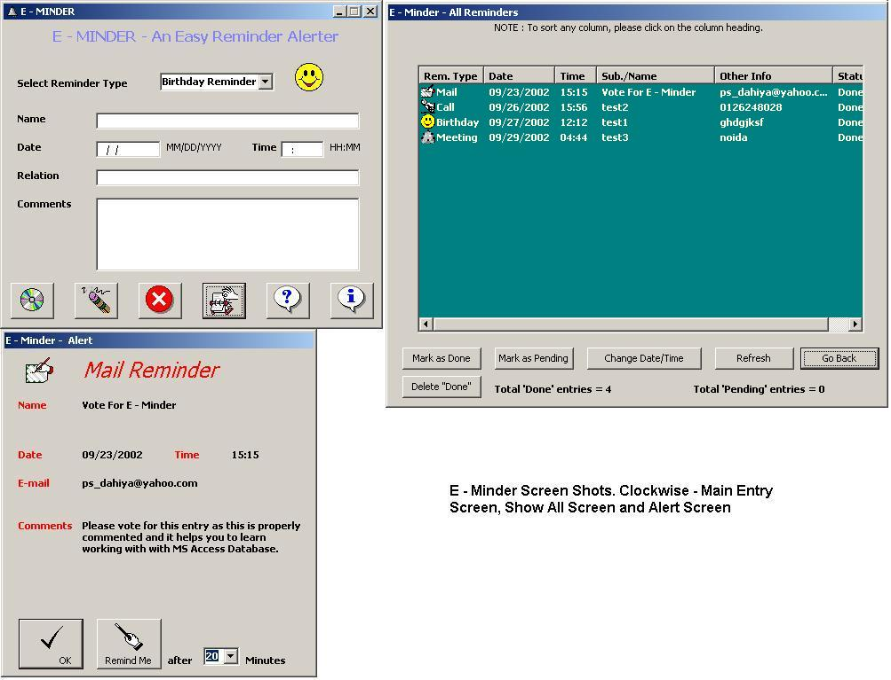



## A 0 E \- Minder \- A Reminder Alerter \- Updated with Full HTML help

### Description

This update includes the HTML help file. I have made this help with "helpMATIC Pro HTML". This is a very easy to use shareware tool to make html help files. Everything else is same as of the previous version of E - Minder.
 
### More Info
 

             |
---                |---
**Submitted On**   |2002-09-27 13:19:32
**By**             |[Parmender Dahiya](https://github.com/Planet-Source-Code/PSCIndex/blob/master/ByAuthor/parmender-dahiya.md)
**Level**          |Intermediate
**User Rating**    |4.7 (28 globes from 6 users)
**Compatibility**  |VB 6\.0
**Category**       |[Databases/ Data Access/ DAO/ ADO](https://github.com/Planet-Source-Code/PSCIndex/blob/master/ByCategory/databases-data-access-dao-ado__1-6.md)
**World**          |[Visual Basic](https://github.com/Planet-Source-Code/PSCIndex/blob/master/ByWorld/visual-basic.md)
**Archive File**   |[A\_0\_E\_\-\_Mi1426741082002\.zip](https://github.com/Planet-Source-Code/parmender-dahiya-a-0-e-minder-a-reminder-alerter-updated-with-full-html-help__1-39645/archive/master.zip)

### API Declarations

In the program

